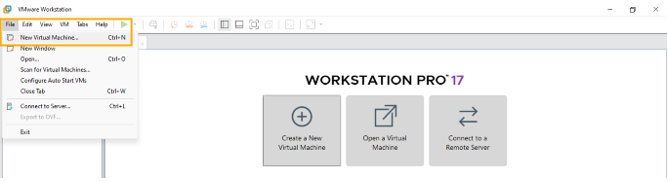
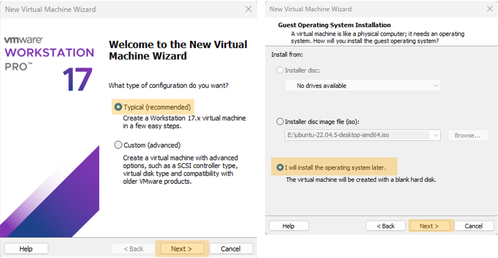
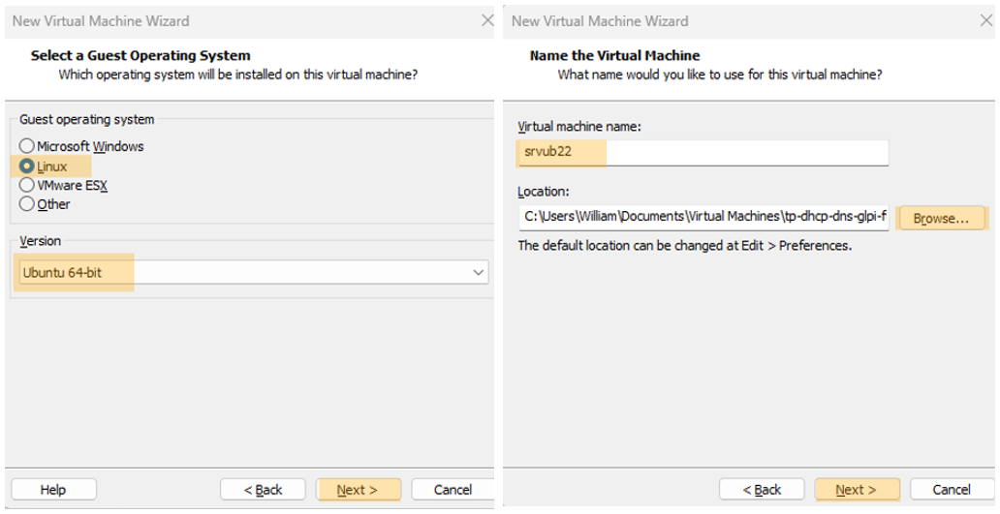
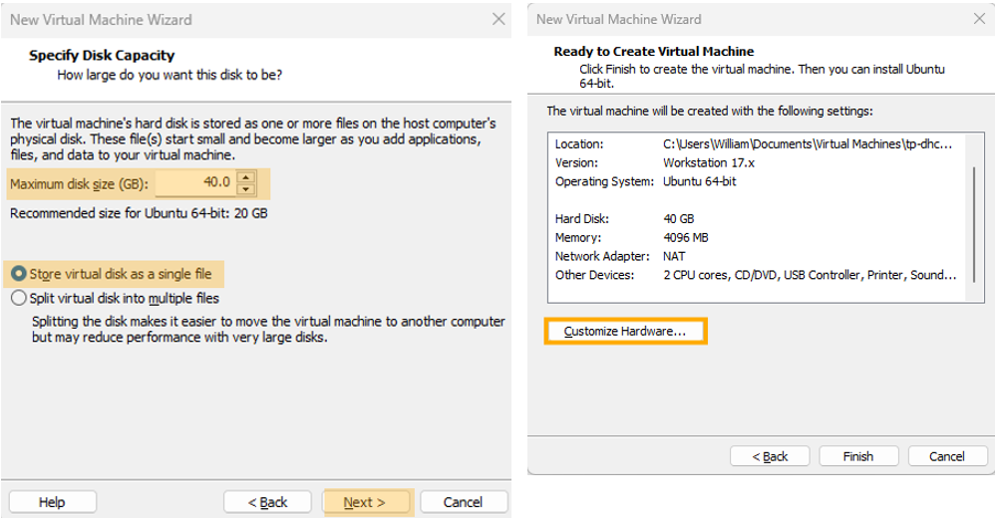
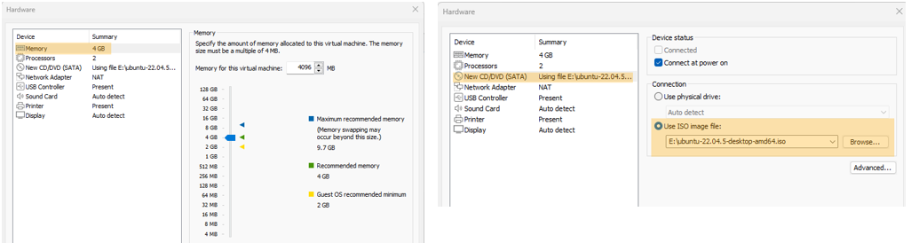
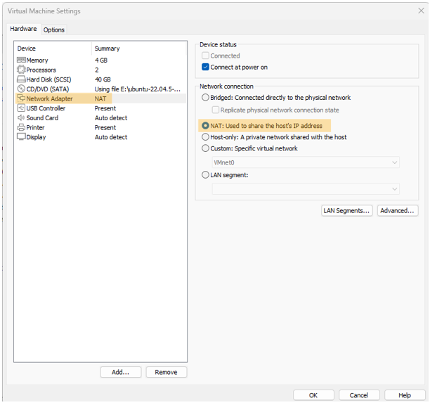
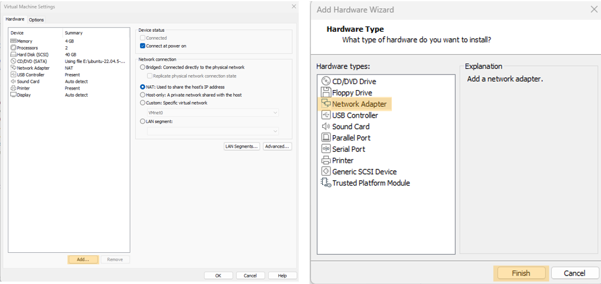
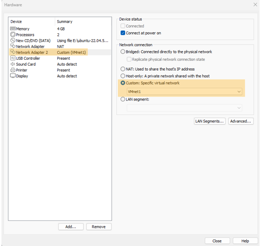
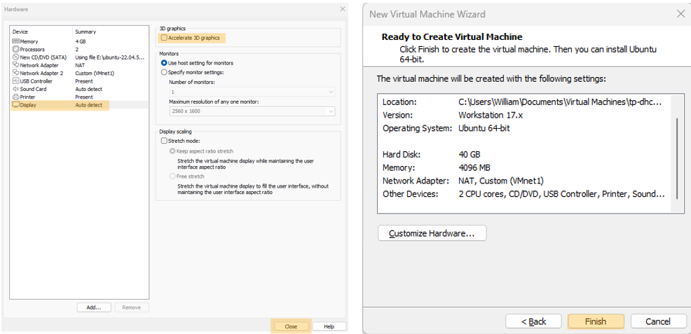
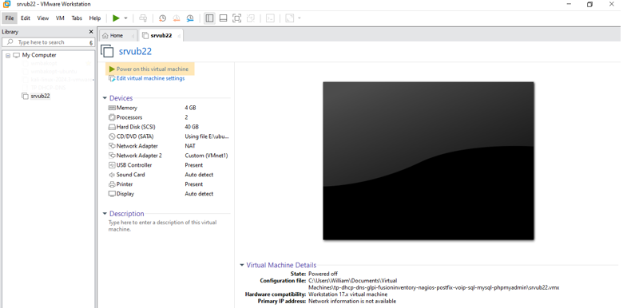

# Création d'une machine virtuelle sur VMware Workstation Pro 17

## Informations

| Champ           | Détails                                                                           |
|-----------------|-----------------------------------------------------------------------------------|
| **Auteur**      | William Mbakop                                                                    |
| **Profession**  | étudiant en alternance - BTS SIO SISR                                             |
| **Version**     | 1.0.0                                                                             |
| **Date**        | 11 janvier 2025                                                                   |
| **Description** | Création d'une machine virtuelle sur VMware Workstation Pro 17 - Cas pratique     |

# Création de la VM et paramétrage de ses composants 

Ajout d'une carte réseau supplémentaire, si nécessaire

# Démarrage de la VM

