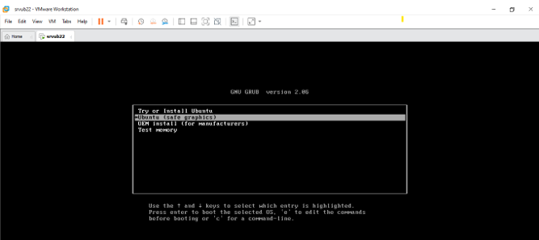
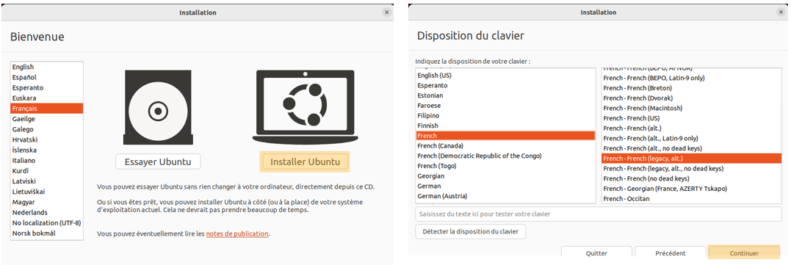
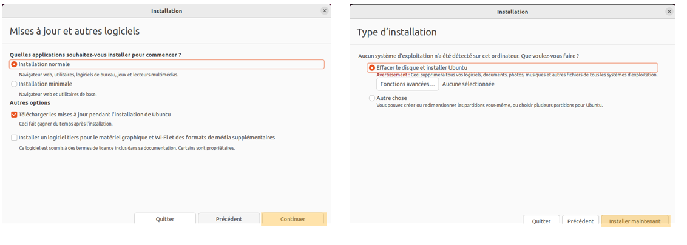
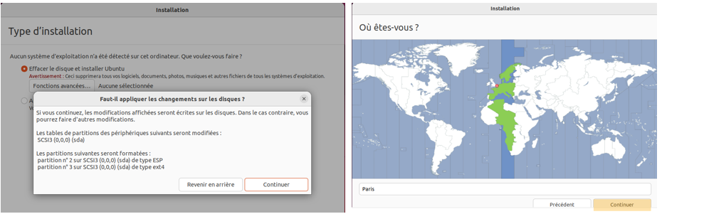
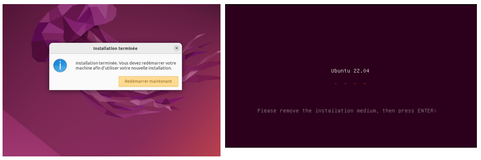
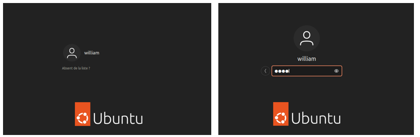
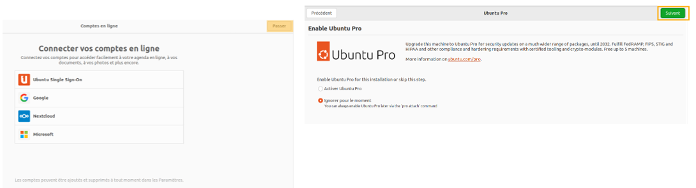
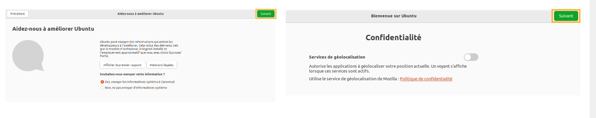
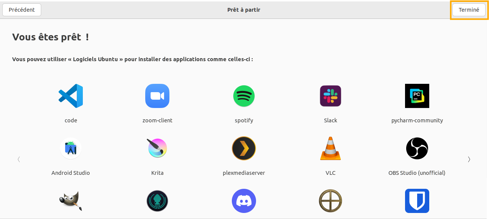

# Installation Ubuntu 22.04.05

## Informations

| Champ           | Détails                                                                           |
|-----------------|-----------------------------------------------------------------------------------|
| **Auteur**      | William Mbakop                                                                    |
| **Profession**  | étudiant en alternance - BTS SIO SISR                                             |
| **Version**     | 1.0.0                                                                             |
| **Date**        | 11 janvier 2025                                                                   |
| **Description** | Installation Ubuntu 22.04.05                                                      |

# Installation

A cette étape, l'installation du système va débuter.

A la question, "une nouvelle version d'Ubuntu est disponible. Souhaitez-vous mettre à niveau votre système?", cliquez sur "Ne pas Mettre à niveau" puis sur "Valider"

A la question "Des mises à jour sont apparues depuis que Ubuntu 22.04 est sortie. Voulez-vous les installer maintenant ?", cliquez sur "Me le rappeler plus tard"